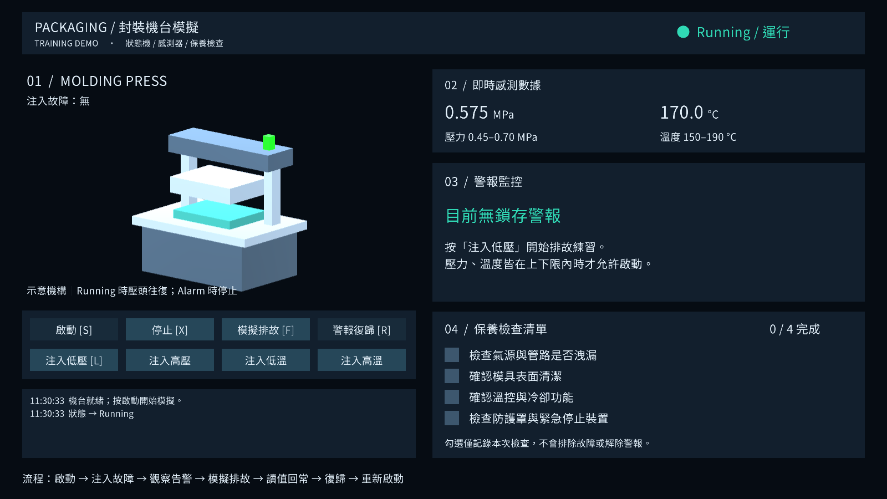
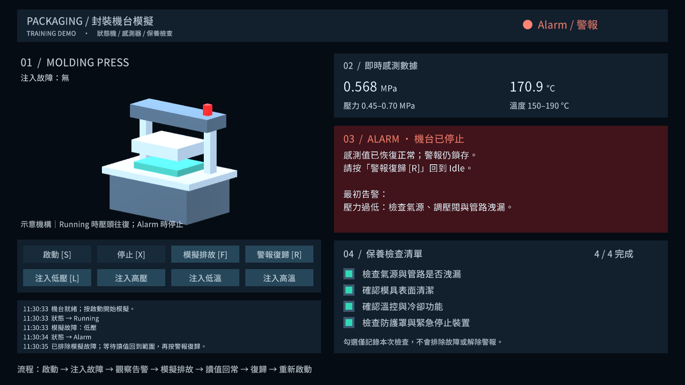

# 驗證紀錄

驗證日期：2026-09-30。最終一次完整測試：11:30（Asia/Taipei）。

| 項目 | 結果 |
|---|---|
| C# 編譯、TMP 資源匯入、場景建立與引用補齊 | 通過 |
| EditMode 核心測試 | **16 / 16 通過** |
| PlayMode 執行測試 | **3 / 3 通過** |
| 1600×900 中文 UI、3D 機台、警報與回常狀態渲染 | 已產生並檢視 |
| Unity 2022.3 LTS 原版本執行 | **尚未驗證：本機未安裝** |
| Windows 獨立 Player 建置 | 本次未執行 |

來源專案保留 Unity **2022.3.62f1** 與 Input System **1.7.0**、TextMeshPro **3.0.9**、uGUI **1.0.0**、Test Framework **1.1.33**。本機實際測試使用 **Unity 6000.3.0f1**，位置為 `TestResults/ValidationProject` 隔離副本。Unity 升級副本後使用 Input System **1.16.0**、uGUI **2.0.0**（含 TMP）、Test Framework **1.6.0**。這些結果不等於 2022 LTS 或其套件版本已驗證。

## 驗證範圍

EditMode 檢查無資料不可啟動、上下限等值允許、四種越界警報、故障未排除不可復歸、停止不能清除 Alarm、回常後仍鎖存、復歸後回到 Idle、同時發生的異常須全部回常、無效感測值、無效閾值、不重複發送相同狀態事件，以及四種感測注入與漸進復原。

PlayMode 載入交付場景，檢查 UI 按鈕觸發的完整低壓排故流程、保養四項勾選及完成數、告警顯示、復歸按鈕條件、可見 TMP 文字框溢出。另以 Input System 合成鍵盤裝置驗證 S／X，並以合成滑鼠經 EventSystem／GraphicRaycaster 實際點擊啟動按鈕。

背景測試暫時將 Input System 的焦點路由設成接收 Game 輸入，結束時還原。測試不移動桌面游標；尚未由人工操作可見 Editor 視窗逐一驗收所有解析度及輸入裝置。

首次執行發現 TMP 匯入是非同步操作、文字框高度及背景輸入焦點問題，均已修正並重跑通過。最終 XML 保存於 [EditMode.xml](Results/EditMode.xml) 與 [PlayMode.xml](Results/PlayMode.xml)。可用專案 `Tools/Verify.ps1` 重現測試。

## 場景與圖片

交付場景保留機台入口與腳本引用；字型與材質由 **Tools → Packaging Simulator → Create or Open Demo Scene** 在使用者的 Unity 版本建立並補齊，避免將 Unity 6 的 TMP 資源寫回 2022 來源專案。

以下是 Unity 相機與實際 TMP／uGUI Canvas 的離屏渲染，包含 3D 及 UI。這些不是設計稿，也不是桌面視窗截圖。

