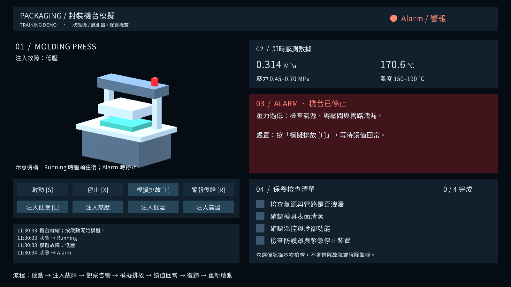
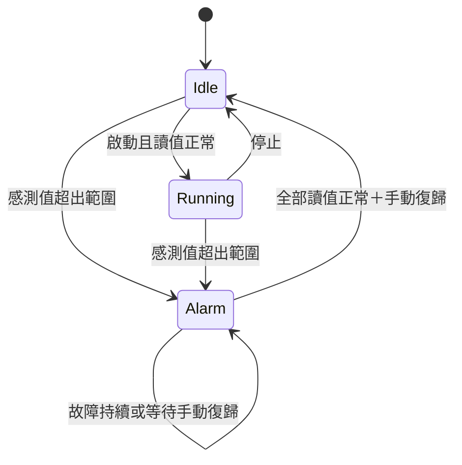

# Unity 封裝機台狀態機範例

使用 **Unity 2022.3 LTS、C#、Input System、TextMeshPro 與 uGUI** 的獨立起始專案。包含基本封膠壓機示意、Idle／Running／Alarm、壓力與溫度模擬、故障注入、手動警報復歸及保養勾選清單。無需購買模型或 UI 資產。

這是通用教學模擬；壓力、溫度與排故提示為示範設定，不代表力成或特定廠牌機台參數。Idle 假設氣源與溫控已就緒，未模擬冷機升溫流程。



已在 Unity 6 隔離副本通過 **16 項 EditMode + 3 項 PlayMode 測試**；Unity 2022 LTS 原版本尚待在該版本 Editor 驗證。詳見下方驗證說明。

## 開啟與執行

1. Unity Hub → **Add project from disk**，選取本資料夾 `PackagingMachineSimulator`。
2. 使用 **Unity 2022.3 LTS** 開啟；專案版本指定為 `2022.3.62f1`。第一次需要網路解析套件。
3. 選 **Tools → Packaging Simulator → Create or Open Demo Scene**。
4. 開啟 `Assets/PackagingSimulator/Scenes/PackagingDemo.unity` 後按 **Play**。

選單會補齊 TMP Essential Resources、中文字型資產、Standard 材質與場景，並加入 Build Settings。重複執行會開啟既有場景，保留場景修改。場景保存入口元件；3D 幾何、Canvas、按鈕與 EventSystem 於 Play 時產生。

專案已設定 **Active Input Handling = Input System Package (New)**。若移植到其他專案，至 **Edit → Project Settings → Player → Other Settings** 設定此選項，按提示重啟 Editor。Built-in Render Pipeline 是此範例的渲染設定。

## 一分鐘演示

1. 按 **啟動 [S]**：Idle → Running，壓頭開始往復，數值小幅波動。
2. 按 **注入低壓 [L]**：壓力逐漸降至下限以下，進入 Alarm，壓頭停止，面板提示檢查氣源、調壓閥與管路。
3. 故障仍存在時，**警報復歸 [R]** 不可用；停止或重複啟動也不能跳過警報。
4. 按 **模擬排故 [F]**：解除故障注入，等待約 1–2 秒讓讀值恢復。
5. 警報仍維持鎖存。按 **警報復歸 [R]** 回到 Idle，再按 **啟動 [S]**。
6. 勾選右側保養工作，觀察完成數更新；勾選不會修好故障或解除警報。

鍵盤操作前先點 Game 視窗取得焦點。滑鼠可操作所有按鈕及勾選框。其他故障按鈕可示範高壓、低溫與高溫；一次注入一種故障，新故障會替換前一種。

| 操作 | 快捷鍵 | 結果 |
|---|---|---|
| 啟動 | S | 僅允許 Idle 且已有正常感測資料 |
| 停止 | X | Running → Idle |
| 注入低壓 | L | 模擬持續低壓，即使 Alarm 也不會自動消失 |
| 模擬排故 | F | 解除故障注入，數據漸進回常 |
| 警報復歸 | R | Alarm 且全部讀值正常 → Idle |

## 狀態與閾值



| 感測器 | 正常範圍（含上下限） | 低於下限 | 高於上限 |
|---|---|---|---|
| 壓力 | 0.45–0.70 MPa | 檢查氣源、調壓閥、管路洩漏 | 檢查調壓閥 |
| 溫度 | 150–190 °C | 檢查加熱器及溫控 | 檢查冷卻及溫控 |

在場景入口的 **Sensor Simulator → Limits** 修改上下限。正常值以範圍中點為目標，疊加小幅週期波動；故障目標位於界外，以指數平滑逐漸接近。資料持續更新，狀態每幀檢查。NaN、Infinity 或上下限設定錯誤也會阻擋運轉。

此起始範例沒有警報延遲或遲滯、資料儲存、實體 PLC 通訊、歷史曲線或資產管理系統。保養勾選只存在本次 Play，不作為啟動聯鎖。

## 程式分工

| 程式碼 | 責任 |
|---|---|
| `Assets/PackagingSimulator/Core/MachineStateMachine.cs` | 純 C# 狀態機、上下限、警報原因、鎖存與復歸判斷 |
| `Assets/PackagingSimulator/Runtime/SensorSimulator.cs` | 壓力／溫度波動、四種故障與平滑回復 |
| `Assets/PackagingSimulator/Runtime/MachineController.cs` | 每幀採樣、InputActionMap 快捷鍵、操作 API 與最近六筆日誌 |
| `Assets/PackagingSimulator/Runtime/PackagingUI.cs` | TextMeshPro 文字、uGUI 按鈕、InputSystemUIInputModule 與告警面板 |
| `Assets/PackagingSimulator/Runtime/MaintenanceChecklist.cs` | 四個 Toggle 與完成數 |
| `Assets/PackagingSimulator/Runtime/MachineView.cs` | 基本幾何機台、運行動畫與狀態燈 |
| `Assets/PackagingSimulator/Editor/DemoSceneBuilder.cs` | 建立或開啟場景、自動連接中文字型與材質 |

UI 按鈕與 Input System 快捷鍵共用 `MachineController` 的公開方法。UI 依狀態更新顯示，狀態機本身也驗證操作條件，因此直接呼叫方法同樣不能跳過警報。

例如，不依賴 Unity 場景的核心操作如下：

```csharp
var machine = new PackagingSim.MachineStateMachine(new PackagingSim.SensorLimits());
machine.Sample(0.57f, 170f);
machine.Start();                 // Running
machine.Sample(0.30f, 170f);      // Alarm：壓力過低
machine.ResetAlarm();            // false：故障仍存在
machine.Sample(0.57f, 170f);      // 讀值回常，仍是 Alarm
machine.ResetAlarm();            // true：回到 Idle
```

移植時複製 `Assets/PackagingSimulator`，安裝 manifest 中的 Input System、TextMeshPro、uGUI 與 Test Framework 套件，再執行場景建立選單。若替換為自製場景，可保留狀態機與 Controller，改由既有 Inspector 參照更新 UI。

## 驗證

在 **Window → General → Test Runner** 執行 EditMode 與 PlayMode 測試，或使用：

```powershell
./Tools/Verify.ps1 -UnityEditor '你的 Unity 2022.3 Editor/Unity.exe'
```

若想在其他版本驗證而保留來源專案設定：

```powershell
./Tools/Verify.ps1 -UnityEditor '其他版本的 Unity.exe' -UseIsolatedCopy
```

隔離副本放在 `TestResults/ValidationProject`，Unity 升級只作用於此副本。腳本會依序準備場景、執行 EditMode 與 PlayMode，將 XML 與 log 寫入 `TestResults`。PlayMode 包含實際 Input System 裝置事件，以及 Unity 3D／TMP／Canvas 離屏渲染；不會移動桌面滑鼠。

本次實際版本、測試結果和限制見 `Documentation/Verification.md`。**Unity 6 的成功結果不能當成 Unity 2022 LTS 已驗證。**

## 官方參考與素材授權

- [Unity Input System：UI 輸入整合](https://github.com/Unity-Technologies/InputSystem/blob/develop/Packages/com.unity.inputsystem/Documentation~/using-ui-input-module.md)：uGUI 使用 InputSystemUIInputModule 接收輸入。
- [TextMeshPro 3.0 官方指南](https://docs.unity3d.com/ja/Packages/com.unity.textmeshpro%403.0/manual/index.html)：TMP Essential Resources 匯入步驟。
- 隨附 **Noto Sans CJK TC** 字型，授權為 SIL Open Font License；授權全文位於 `Assets/PackagingSimulator/Resources/Fonts/OFL.txt`。字型取自工作區既有的同名授權素材。
- 機台模型由本範例程式建立 Unity primitives，沒有使用外部設備模型或商標。
